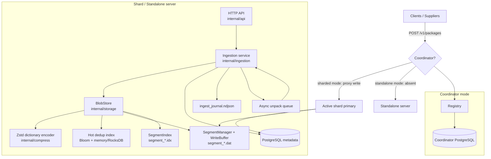
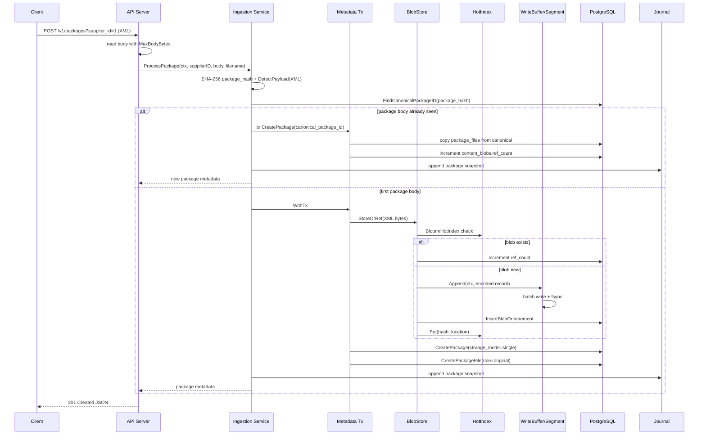
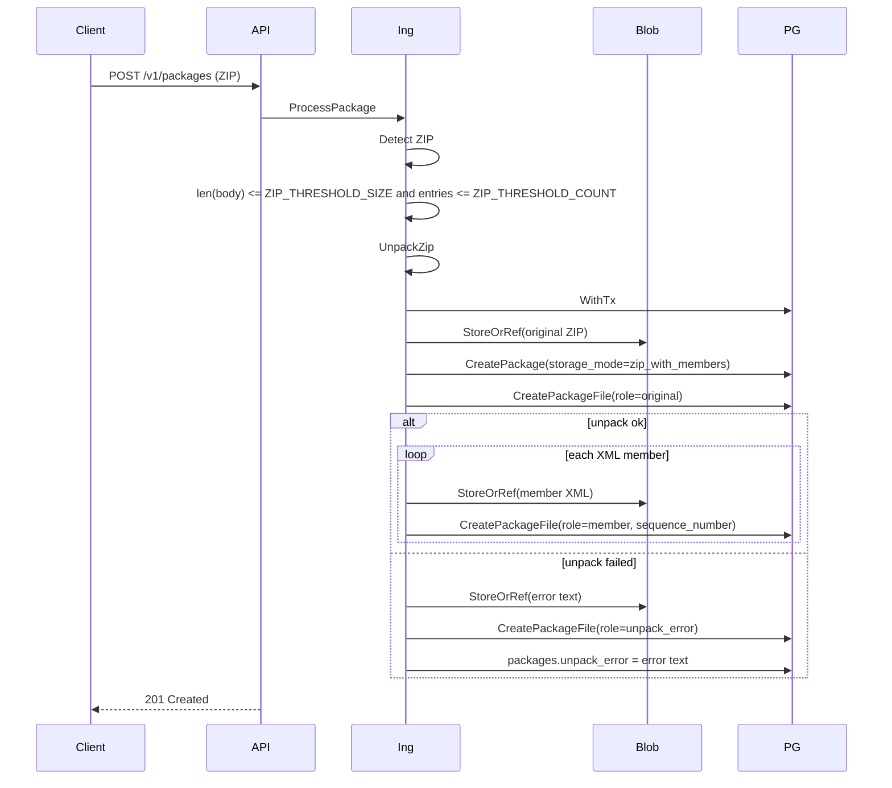
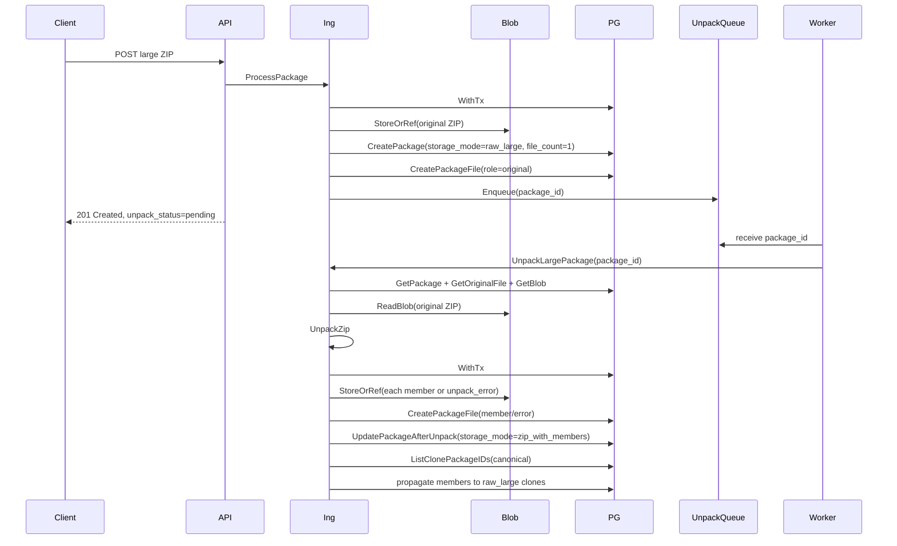
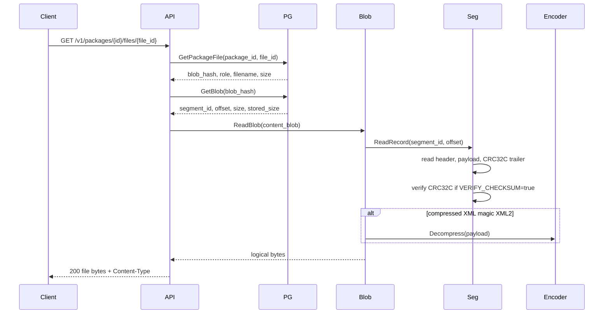
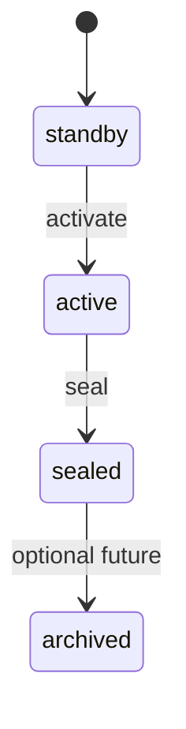
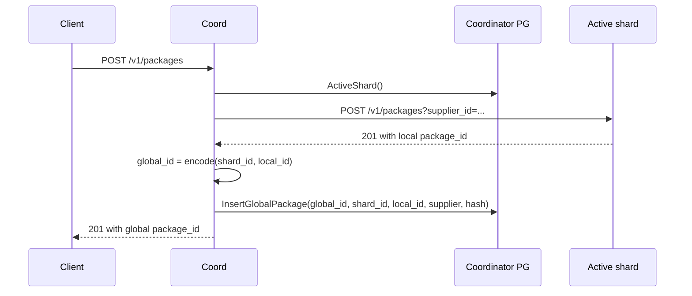

# Документация по реализации little-big-files

Статус: implementation guide для текущей Go-реализации.

Документ описывает фактическую архитектуру сервиса, последовательности основных процессов, структуру хранилища, решения по отказоустойчивости и безопасности. Он дополняет:

- [architecture.md](architecture.md) — концептуальная архитектура и trade-offs;
- [sharding-model.md](sharding-model.md) — модель шардирования;
- [test-stand.md](test-stand.md) — локальный стенд и сценарии проверки;
- [pilot-stand.md](pilot-stand.md) — опытная эксплуатация.

## 1. Назначение системы

`little-big-files` — append-only content-addressed storage для EKB XML/ZIP пакетов с прозрачной дедупликацией.

Ключевые свойства:

- клиент всегда получает новый `package_id`, даже если тело пакета уже загружалось ранее;
- одинаковые физические blob-данные хранятся один раз и переиспользуются через `ref_count`;
- ZIP хранится как оригинальный файл плюс распакованные XML members;
- большие ZIP могут распаковываться асинхронно;
- записи идут в append-only segment-файлы;
- метаданные и связи package -> file -> blob хранятся в PostgreSQL;
- активный write path может работать за Coordinator в volume-based shard-модели.

## 2. Основные исполняемые компоненты

| Команда | Назначение |
|---------|------------|
| `cmd/server` | Шард/standalone ingestion server: HTTP API, storage, metadata, dedup, compression, async unpack. |
| `cmd/coordinator` | Coordinator: маршрутизирует write на active shard, read по global package id, управляет shard registry и seal/rotate. |
| `cmd/shard-sync` | Sidecar для синхронизации segment-файлов с primary shard на replica. |
| `cmd/rebuild-index` | Перестройка hot dedup index из PostgreSQL `content_blobs`. |
| `cmd/recovery-tool` | Восстановление metadata из segment index + ingest journal. |

## 3. Высокоуровневая архитектура



### 3.1. Разделение ответственности

| Слой | Код | Ответственность |
|------|-----|-----------------|
| HTTP API | `internal/api` | Публичные REST endpoints, body limit, ответы JSON/file download, shard write guard, internal endpoints. |
| Ingestion | `internal/ingestion` | Классификация payload, обработка XML/ZIP, clone duplicate package, async unpack large ZIP. |
| Metadata | `internal/metadata` | Транзакции PostgreSQL: packages, package_files, content_blobs, supplier_stats, dictionary. |
| Storage | `internal/storage` | Append-only segment-файлы, write buffer, per-record CRC32C, blob read/write, segment index. |
| Dedup | `internal/dedup` | Hot index: Bloom filter + memory/RocksDB backend. |
| Compression | `internal/compress` | Zstd dictionary bootstrap, compression/decompression XML. |
| Recovery | `internal/recovery` | Journal package metadata, rebuild metadata from segment index + journal. |
| Coordinator | `internal/coordinator` | Shard registry, active/standby/sealed state machine, global package id, proxy read/write. |
| Metrics | `internal/metrics` | Prometheus middleware and gauges/counters. |

## 4. Публичный API

Standalone/shard server:

| Endpoint | Метод | Назначение |
|----------|-------|------------|
| `/v1/packages?supplier_id=&filename=` | `POST` | Загрузка XML/ZIP. Всегда создает новый logical package при успешной обработке. |
| `/v1/packages/{id}` | `GET` | Метаданные пакета и список файлов. |
| `/v1/packages/{id}/files/{file_id}` | `GET` | Скачать конкретный файл пакета. |
| `/v1/packages/{id}/original` | `GET` | Скачать оригинальный XML/ZIP. |
| `/metrics` | `GET` | Prometheus metrics. |

Shard-internal API:

| Endpoint | Метод | Назначение | Защита |
|----------|-------|------------|--------|
| `/v1/internal/stats` | `GET` | `shard_id`, role, read-only, total bytes. | `X-Cluster-Key` / `Bearer`. |
| `/v1/internal/seal` | `POST` | Перевести primary shard в read-only. | `X-Cluster-Key` / `Bearer`. |
| `/v1/internal/segments` | `GET` | Список segment files для sync. | `X-Cluster-Key` / `Bearer`. |
| `/v1/internal/segments/{name}` | `GET` | Скачать raw segment file для replica sync. | `X-Cluster-Key` / `Bearer`. |

Coordinator API:

| Endpoint | Метод | Назначение |
|----------|-------|------------|
| `/v1/packages` | `POST` | Proxy write на active shard, возврат global package id. |
| `/v1/packages/{global_id}` | `GET` | Proxy read на shard, извлеченный из global id. |
| `/v1/packages/{global_id}/files/{file_id}` | `GET` | Proxy file read. |
| `/v1/packages/{global_id}/original` | `GET` | Proxy original read. |
| `/v1/admin/shards` | `GET` | Список шардов. |
| `/v1/admin/shards` | `POST` | Startup registration/upsert shard by UUID. Требует `cluster_key` в body. |
| `/v1/admin/seal-rotate` | `POST` | Manual seal active + activate standby. Требует `cluster_key` в body или `X-Cluster-Key`. |
| `/v1/admin/shards/{id}/state` | `PATCH` | Safe manual state transition. Требует `cluster_key` в body. |

## 5. Основной write path: XML



### 5.1. Важные инварианты write path

- `package_hash = SHA-256(body)` используется для прозрачного clone duplicate package.
- `content_hash = SHA-256(blob bytes)` используется для blob-level dedup.
- Duplicate package получает новый `packages.id`, но с `canonical_package_id`.
- Duplicate blob увеличивает `content_blobs.ref_count`.
- `InsertBlobOrIncrement` атомарно обрабатывает гонку двух параллельных first-write одного blob.
- Запись в segment выполняется до metadata insert. Если транзакция проиграла гонку, физически записанные bytes становятся harmless orphan в append-only segment; они не индексируются в `segment_*.idx`.

## 6. Write path: ZIP

### 6.1. Small ZIP



### 6.2. Large ZIP async unpack

Large ZIP определяется как:

- `len(body) > ZIP_THRESHOLD_SIZE`, или
- `CountZipEntries(body) > ZIP_THRESHOLD_COUNT`.



### 6.3. Durable recovery scan для async unpack

`UnpackQueue` остается in-memory, но состояние задачи выводится из metadata:

- пока пакет не распакован, `packages.storage_mode = 'raw_large'`;
- после успешной транзакции распаковки становится `zip_with_members`;
- recovery loop периодически вызывает `ListPendingLargePackages()` и переэнкьюит все canonical `raw_large` packages.

Это закрывает два сценария:

- процесс упал после ответа клиенту, но до выполнения worker;
- очередь была заполнена и job был dropped.

In-flight map предотвращает повторную одновременную распаковку одного `package_id`.

## 7. Read path



В Coordinator mode:

1. клиент читает `/v1/packages/{global_id}`;
2. Coordinator декодирует `global_id = [16 bit shard_id][48 bit local_id]`;
3. берет shard из `shard_registry`;
4. для sealed shard предпочитает `replica_url`, если задан;
5. proxy-запрос идет на `/v1/packages/{local_id}`.

## 8. Структура metadata в PostgreSQL shard/standalone

### 8.1. `content_blobs`

Уникальные физические blob-данные.

| Поле | Назначение |
|------|------------|
| `content_hash BYTEA PRIMARY KEY` | SHA-256 logical bytes. |
| `size INT` | Logical size до compression. |
| `stored_size INT` | Bytes записи на диске: header + payload + CRC trailer. |
| `segment_id INT` | Номер segment-файла. |
| `"offset" BIGINT` | Offset начала record header в segment. |
| `ref_count BIGINT` | Количество package_files, ссылающихся на blob. |
| `first_seen_at TIMESTAMPTZ` | Время первой регистрации. |

### 8.2. `packages`

Логический пакет клиента.

| Поле | Назначение |
|------|------------|
| `id BIGSERIAL` | Local package id в пределах shard. |
| `supplier_id INT` | Поставщик. |
| `package_hash BYTEA` | SHA-256 всего POST body. Не unique. |
| `payload_type` | `xml` / `zip`. |
| `storage_mode` | `single`, `zip_with_members`, `raw_large`. |
| `canonical_package_id` | Ссылка на canonical package при duplicate POST body. |
| `file_count` | Количество файлов в package response. |
| `unpack_error` | Текст ошибки распаковки, если есть. |

### 8.3. `package_files`

Связь package -> blob.

| Поле | Назначение |
|------|------------|
| `id BIGSERIAL` | File id внутри shard. |
| `package_id` | FK на `packages`. |
| `blob_hash` | FK на `content_blobs.content_hash`. |
| `role` | `original`, `member`, `unpack_error`. |
| `original_filename` | Имя файла/ZIP member. |
| `sequence_number` | Порядок member внутри ZIP. |

### 8.4. `supplier_stats`

Агрегаты ingestion по supplier:

- `total_packages`;
- `total_refs`;
- `duplicate_refs`;
- `last_activity`.

### 8.5. `compression_dictionary`

Словари Zstd:

- `dict_data BYTEA`;
- `entry_count`;
- `created_at`.

Также dictionary sidecar хранится на диске в `../dictionaries/current.json` и `dict_*.zdict` относительно `DATA_DIR`.

## 9. Структура файлового хранилища

Типовая структура `DATA_DIR`:

```text
data/
  segments/
    segment_0000.dat
    segment_0000.idx
    segment_0001.dat
    segment_0001.idx
    ingest_journal.ndjson
  dictionaries/
    current.json
    dict_0001_<sha>.zdict
  rocksdb/
    ...
```

### 9.1. Segment file: `segment_NNNN.dat`

Формат записи:

```text
[4 bytes magic][4 bytes payload_size][payload bytes][4 bytes CRC32C(payload)]
```

Known magic:

| Magic | Hex | Значение |
|-------|-----|----------|
| `XML1` | `0x584D4C31` | Raw XML payload. |
| `XML2` | `0x584D4C32` | Compressed XML payload. |
| `ZIP1` | `0x5A495031` | ZIP payload. |
| `ERR1` | `0x45525231` | Text payload with unpack error. |

При rotation/seal старого segment добавляется footer:

```text
[4 bytes record_count][8 bytes total_size][16 bytes reserved][4 bytes FOOT]
```

Особенности:

- `offset` в metadata указывает на начало header;
- `stored_size = header + payload + CRC`;
- read path проверяет CRC32C, если `VERIFY_CHECKSUM=true`;
- recovery scan принимает только known magic и валидный CRC.

### 9.2. Segment index: `segment_NNNN.idx`

Sidecar index ускоряет recovery metadata.

Entry size: 60 bytes.

| Поле | Размер | Назначение |
|------|--------|------------|
| `Offset` | 8 | Offset record в `.dat`. |
| `StoredSize` | 4 | On-disk record size. |
| `LogicalSize` | 4 | Logical blob size. |
| `Magic` | 4 | Record magic. |
| `Hash` | 32 | SHA-256 content hash. |
| `SupplierID` | 4 | Supplier id для аудита/recovery. |
| `DictID` | 4 | Compression dictionary id. |

Index footer содержит:

- version;
- record count;
- last offset;
- CRC32 index entries;
- magic `IDXF`.

### 9.3. WriteBuffer

`WriteBuffer` агрегирует несколько writes и делает один `fsync` на flush.

Flush triggers:

- `bufSize >= WRITE_BUFFER_MAX_BYTES`;
- ticker `WRITE_BUFFER_INTERVAL`;
- `Close()`.

Гарантии и поведение:

- `Append(ctx, record)` блокируется до durable flush или ошибки;
- при отмене `ctx` возвращает `ctx.Err()`, не удерживая caller навечно;
- один record failure не проваливает весь batch;
- fsync failure помечает все успешно записанные в batch records как failed.

## 10. Dedup и compression

### 10.1. Package-level dedup

Первый уровень:

```text
package_hash = SHA-256(POST body)
FindCanonicalPackageID(package_hash)
```

Если canonical найден:

- создается новый `packages` row;
- копируются `package_files`;
- ref_count всех blob увеличивается;
- клиент получает новый `package_id`.

### 10.2. Blob-level dedup

Второй уровень:

```text
content_hash = SHA-256(logical blob bytes)
```

Алгоритм:

1. если HotIndex/Bloom точно miss -> попробовать storeNew;
2. если HotIndex hit -> `IncrementRefCountIfExists`;
3. fallback lookup в PostgreSQL;
4. если отсутствует -> encode/compress + append segment + `InsertBlobOrIncrement`.

`InsertBlobOrIncrement` важен для concurrent first-write:

- один запрос вставляет row;
- второй попадает в `ON CONFLICT` и атомарно увеличивает `ref_count`;
- HTTP 500 по unique violation не возникает.

### 10.3. Compression

XML payload может быть сжат Zstd:

- включается `COMPRESSION_ENABLED=true`;
- минимальный размер `COMPRESSION_MIN_SIZE`;
- словарь загружается из sidecar или PostgreSQL;
- если словаря нет, обучается на `EXAMPLES_DIR`;
- compressed XML получает magic `XML2`;
- logical hash считается по исходным bytes, не по compressed payload.

## 11. Coordinator и shard lifecycle



### 11.1. Global package id

```text
[16 bit shard_id][48 bit local_package_id]
```

Кодирование:

- `globalid.Encode(shardID, localID)`;
- `globalid.Decode(globalID)`.

### 11.2. Write routing



### 11.3. Seal/rotate

```mermaid
sequenceDiagram
    participant Loop as Coordinator seal loop
    participant Repo as Coordinator PG
    participant Active
    participant Standby

    Loop->>Repo: ActiveShard()
    Loop->>Active: GET /v1/internal/stats + X-Cluster-Key
    Active-->>Loop: total_bytes
    alt total_bytes >= SHARD_MAX_BYTES
        Loop->>Repo: StandbyShard()
        Loop->>Standby: GET /v1/internal/stats + X-Cluster-Key
        Loop->>Active: POST /v1/internal/seal + X-Cluster-Key
        Active->>Active: readOnly=true
        Loop->>Repo: active -> sealed, save total_bytes/sealed_at
        Loop->>Repo: standby -> active
    end
```

Важная деталь безопасности: Coordinator-to-shard internal calls передают `X-Cluster-Key`. Без этого shard вернет `401`.

### 11.4. Coordinator metadata

`shard_registry`:

- `shard_id`;
- `shard_uuid` (migration `002_shard_identity.sql`);
- `state`;
- `primary_url`;
- `replica_url`;
- `total_bytes`;
- reachability fields.

`global_package_index`:

- `global_id`;
- `shard_id`;
- `local_id`;
- `supplier_id`;
- `received_at`;
- `package_hash`.

`global_xml_index` присутствует как schema-заготовка, но в текущем MVP intentionally не заполняется и не используется публичным API.

## 12. Отказоустойчивость

### 12.1. Durability write path

| Компонент | Механизм |
|-----------|----------|
| PostgreSQL metadata | ACID transaction + WAL. |
| Segment data | Append + `fsync` direct или per-batch. |
| Segment index | Append entry + footer + `fsync`. |
| Ingest journal | NDJSON append + `fsync` после каждого package snapshot. |
| Dedup hot index | Rebuildable из PostgreSQL `content_blobs`. |
| Async unpack | Recovered из `packages.storage_mode='raw_large'`. |

### 12.2. Crash scenarios

#### Crash после segment append, до metadata commit

Эффект:

- bytes могли попасть в segment;
- metadata row отсутствует;
- blob недостижим клиенту.

Решение:

- append-only допускает orphan bytes;
- если `InsertBlobOrIncrement` не вставил новый row, запись не попадает в segment index;
- recovery metadata не создаст package/file без journal entry.

#### Crash после metadata commit, до journal append

Эффект:

- PostgreSQL содержит package;
- journal может не содержать package snapshot.

Решение:

- обычный runtime опирается на PostgreSQL;
- recovery-tool применим для восстановления metadata из segment index + journal; для максимальной полноты важно, чтобы journal append выполнялся после успешного load package и fsync.

#### Crash во время async large ZIP unpack

Эффект:

- package может остаться `raw_large`;
- часть member rows может быть не committed из-за transaction rollback.

Решение:

- recovery scan переэнкьюит `raw_large`;
- `UnpackLargePackage` idempotent: если уже `zip_with_members`, возвращает nil.

#### Crash/partial write segment

Эффект:

- хвост segment может содержать неполную запись.

Решение:

- при `NewSegmentManager.recover()` читается активный segment;
- `truncateToValid` сканирует records до первой невалидной записи;
- record валиден только если magic known, payload полностью прочитан, CRC32C совпадает;
- хвост отрезается.

### 12.3. Recovery-tool

`recovery.Rebuild`:

1. опционально truncates recovery tables;
2. загружает compression dictionary sidecar;
3. читает `segment_*.idx`;
4. восстанавливает `content_blobs`;
5. читает `ingest_journal.ndjson`;
6. восстанавливает `packages` и `package_files`;
7. пересчитывает `ref_count`;
8. сбрасывает sequences.

### 12.4. Replica/sync модель

Replica shard:

- запускается с `SHARD_ROLE=replica`;
- public write запрещен `ShardGuard`;
- `shard-sync` периодически получает `/v1/internal/segments` и скачивает missing/different segment files;
- sync requests авторизуются cluster key.

PostgreSQL replication в compose/stand описывается как отдельный слой стенда; сегменты синхронизируются HTTP sidecar.

## 13. Безопасность

### 13.1. Body limits и payload validation

- HTTP body ограничен `MAX_BODY_BYTES`;
- пустые body и unsupported payload получают client error;
- ZIP detection по `PK`;
- XML detection по leading `<` / `<?xml`.

### 13.2. ZIP handling

Защита от простого path traversal:

- директории пропускаются;
- ZIP member name с `..` пропускается;
- файлы не распаковываются на filesystem, bytes читаются в память и сохраняются как blob.

Ограничение:

- нет отдельного лимита total uncompressed ZIP bytes на member-level, кроме общего `MAX_BODY_BYTES` для исходного ZIP и threshold routing. Для production стоит добавить лимит распакованного объема/ratio.

### 13.3. Internal endpoint auth

Все shard `/v1/internal/*` endpoints требуют shared secret:

- `X-Cluster-Key: <key>`, или
- `Authorization: Bearer <key>`.

Ключ:

- `CLUSTER_KEY`, если задан;
- fallback `SHARD_CLUSTER_KEY`;
- если ключ отсутствует, endpoints disabled (`503`).

Сравнение выполняется через `subtle.ConstantTimeCompare`.

Почему важно:

- `/v1/internal/segments/{name}` отдает raw segment bytes, т.е. весь сохраненный payload;
- `/v1/internal/seal` меняет write availability shard.

### 13.4. Coordinator admin auth

Mutating admin operations проверяют `cluster_key` в JSON body:

- `POST /v1/admin/shards`;
- `PATCH /v1/admin/shards/{id}/state`.

Проверка:

- `CLUSTER_KEY` должен быть настроен;
- compare constant-time.

Замечание:

- `POST /v1/admin/seal-rotate` проверяет cluster key (`cluster_key` в body или `X-Cluster-Key`).
- Coordinator admin API всё равно рекомендуется ограничивать сетевыми политиками/reverse proxy auth.

### 13.5. ShardGuard write protection

`ShardGuard` запрещает `POST /v1/packages`, если:

- `SHARD_READ_ONLY=true`;
- `SHARD_ROLE=replica`.

Это защищает sealed shards и replicas от accidental writes.

### 13.6. Content-Disposition

Download endpoint формирует:

```text
Content-Disposition: attachment; filename="<filename>"
```

Имена приходят из query/ZIP metadata. Для строгого production-hardening рекомендуется sanitization/escaping filename для header injection edge cases.

## 14. Наблюдаемость

### 14.1. HTTP metrics

Middleware `metrics.Middleware` измеряет HTTP requests/latency.

### 14.2. Shard metrics

- total bytes;
- read-only state;
- blob logical/stored/referenced totals;
- seal/coordinator metrics.

### 14.3. Async unpack metrics

- `lbf_unpack_enqueued_total`;
- `lbf_unpack_dropped_total`;
- `lbf_unpack_recovered_total`.

`dropped` не означает потерю данных: recovery scan переобнаружит `raw_large`.

## 15. Конфигурация ключевых параметров

| Env | Default | Назначение |
|-----|---------|------------|
| `PG_DSN` | local PostgreSQL | Metadata shard/standalone. |
| `DATA_DIR` | `./data/segments` | Segment/index/journal directory. |
| `HTTP_ADDR` | `:8080` | HTTP listen address. |
| `MAX_BODY_BYTES` | `64MB` | Max upload body. |
| `ZIP_THRESHOLD_SIZE` | `102400` | Large ZIP threshold by input size. |
| `ZIP_THRESHOLD_COUNT` | `100` | Large ZIP threshold by entry count. |
| `LARGE_ZIP_ASYNC_UNPACK` | `true` | Enable background unpack. |
| `UNPACK_WORKERS` | `2` | Worker count. |
| `UNPACK_QUEUE_SIZE` | `256` | Queue capacity. |
| `UNPACK_RECOVER_INTERVAL` | `1m` | Recovery scan for `raw_large`. |
| `WRITE_BUFFER_MAX_BYTES` | `4MB` | Batch flush size. |
| `WRITE_BUFFER_INTERVAL` | `100ms` | Batch flush interval. |
| `VERIFY_CHECKSUM` | `true` | Verify CRC32C on read. |
| `COMPRESSION_ENABLED` | `true` | Zstd compression for XML. |
| `COMPRESSION_MIN_SIZE` | `64` | Minimum XML size to compress. |
| `DEDUP_BACKEND` | `memory` | `memory`, `postgres`, `rocksdb`. |
| `BLOOM_EXPECTED_ITEMS` | `1000000` | Bloom sizing. |
| `BLOOM_FALSE_POSITIVE` | `0.001` | Bloom FP target. |
| `DEDUP_REBUILD_ON_START` | `true` | Rebuild hot index from PG. |
| `CLUSTER_KEY` | unset | Coordinator/admin/internal shared secret. |
| `SHARD_CLUSTER_KEY` | unset | Shard copy of cluster secret. |
| `COORDINATOR_URL` | unset | Enables startup registration. |
| `SHARD_UUID` | unset | Stable shard identity. |
| `SHARD_ADVERTISE_URL` | unset | URL registered in Coordinator. |
| `SHARD_MAX_BYTES` | `500GB` | Seal threshold. |
| `SEAL_CHECK_INTERVAL` | `30s` | Coordinator seal loop interval. |

## 16. Known limitations / дальнейшие улучшения

1. `global_xml_index` и lookup по XML hash пока вне scope MVP (реализован только routing по global package id).
2. Coordinator currently does not send cluster key on public shard proxy requests; this is fine because public `/v1/packages` on shards remains unauthenticated inside the trusted cluster. If shards are exposed outside the private network, add service-to-service auth.
3. Нет лимита total uncompressed ZIP size/ratio; стоит добавить защиту от zip bombs.
4. `DEDUP_BACKEND=memory` подходит для stand/dev; production должен использовать persistent backend (`rocksdb`) и реалистичный Bloom sizing.
5. Старые segment files без CRC32C trailer несовместимы с новым форматом. Для pre-production это приемлемо; для production migration нужен compatibility reader.
6. Segment orphan bytes не чистятся (append-only design). Для production можно добавить offline compaction, если wasted space станет значимым.
7. Filename в `Content-Disposition` стоит дополнительно sanitize/escape.
