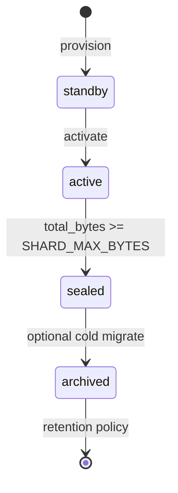
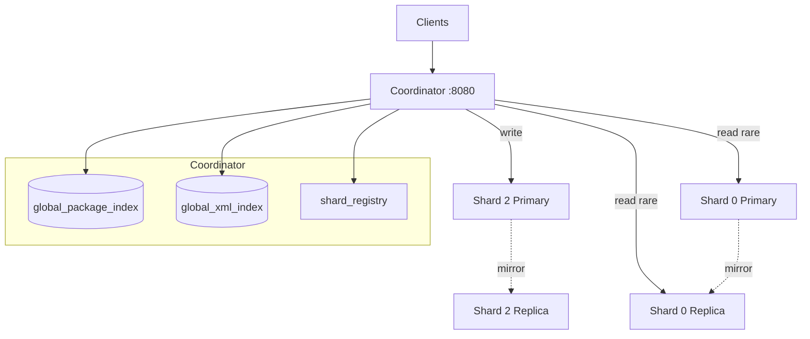
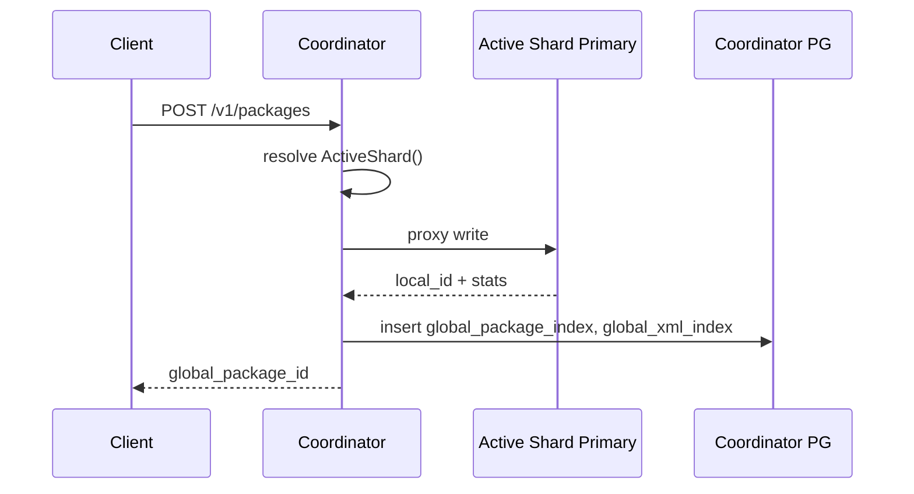
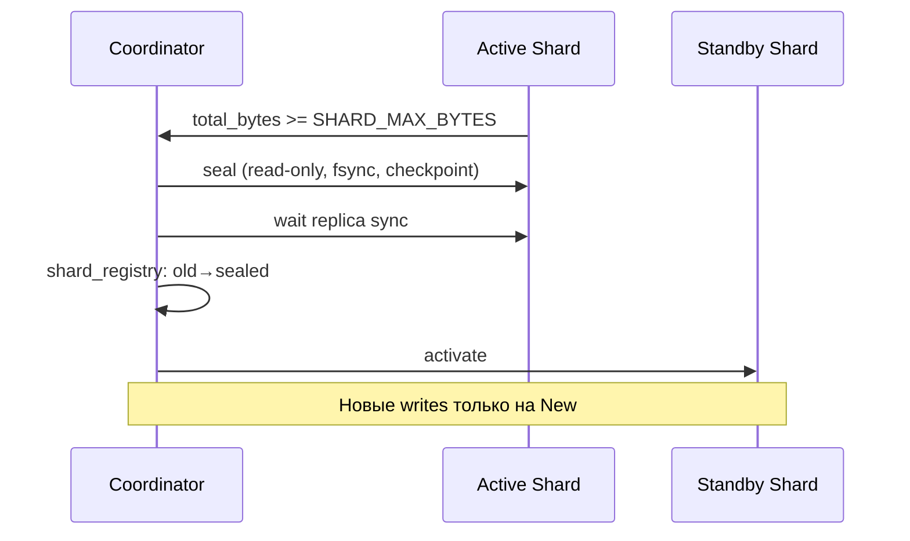
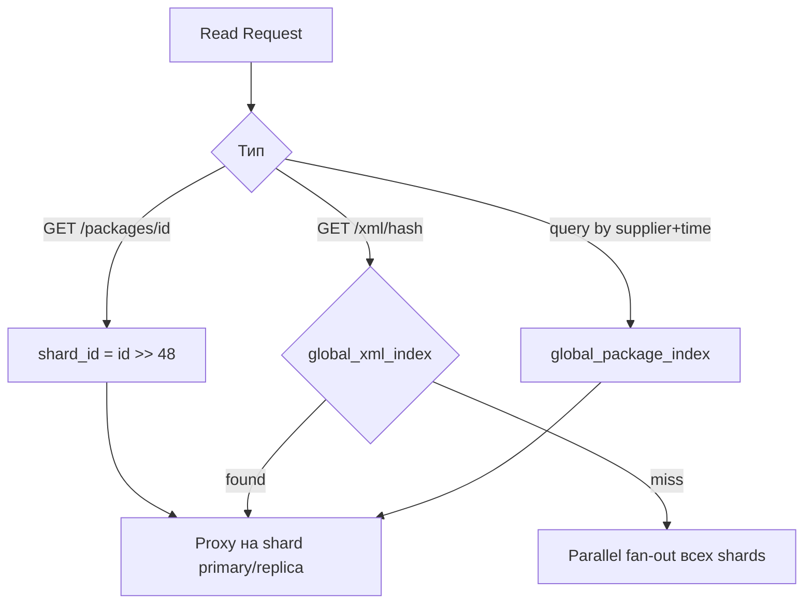

# Модель шардирования (volume-based)

> Обновлено под вводную: чтение редкое; шардирование по **объёму** (rolling seal), не по `supplier_id`. См. также [architecture.md](../architecture.md) §7.

## Суть

- **Write** — всегда на один **active** шард (текущий поток данных)
- **Seal** — когда шард заполнен (`SHARD_MAX_BYTES`) → read-only, «остывает»
- **Read** — редко, с любого шарда через **Coordinator** + global index
- **Зеркалирование** — primary + replica на каждый шард

---

## 1. Жизненный цикл шарда



| State | Write | Read | Tier |
|-------|-------|------|------|
| `standby` | Нет | Нет | — |
| `active` | **Да (единственный)** | Да | NVMe |
| `sealed` | Нет | Да (редко) | HDD |
| `archived` | Нет | Очень редко | S3 / object storage |

---

## 2. Физическая модель



---

## 3. Write path



Все поставщики пишут на **один** active шард → дедупликация работает **между suppliers** в текущем потоке.

---

## 4. Seal и ротация



**Добавление шарда = seal + activate.** Rehash и миграция данных не нужны.

---

## 5. Read path (редкий)



Чтение редкое → fan-out по всем sealed шардам допустим как fallback.

---

## 6. Глобальный package_id

```
┌────────────────┬────────────────────────────────────────────────┐
│  shard_id      │           local_package_id                       │
│  16 bit        │           48 bit                                 │
└────────────────┴────────────────────────────────────────────────┘
```

---

## 7. Зеркалирование

| Компонент | Primary → Replica |
|-----------|-------------------|
| PostgreSQL | Streaming replication |
| Segments | rsync/lsyncd или batch при seal |
| RocksDB | Checkpoint copy |
| Bloom | Copy при seal |

- **Write** → primary active shard only
- **Read** (конфликты, анализ) → replica sealed shard (меньше нагрузка)

---

## 8. Дедупликация

| Сценарий | Поведение |
|----------|-----------|
| Два supplier, один XML, active shard | 1 копия (dedup) |
| Тот же XML после seal на новом active | 2 копии (приемлемо) |
| Чтение старого XML | global_xml_index → нужный sealed shard |

---

## 9. Отличие от supplier_id sharding

| | supplier_id % N | volume-based (текущая модель) |
|--|-----------------|--------------------------------|
| Добавление шарда | Rehash + миграция | Seal + activate |
| Cross-supplier dedup | Только внутри шарда | Внутри active (все suppliers) |
| «Остывание» | Нет естественного | Sealed = cold |
| Чтение | Нужен supplier_id для XML | Global index / fan-out |
| Hot-spot | По supplier | По времени (один writer) |

---

## 10. Конфигурация

```
SHARD_MAX_BYTES=536870912000   # 500 GB
COORDINATOR_PG_DSN=...
SHARD_ROLE=primary|replica
STORAGE_TIER=hot|cold
```
